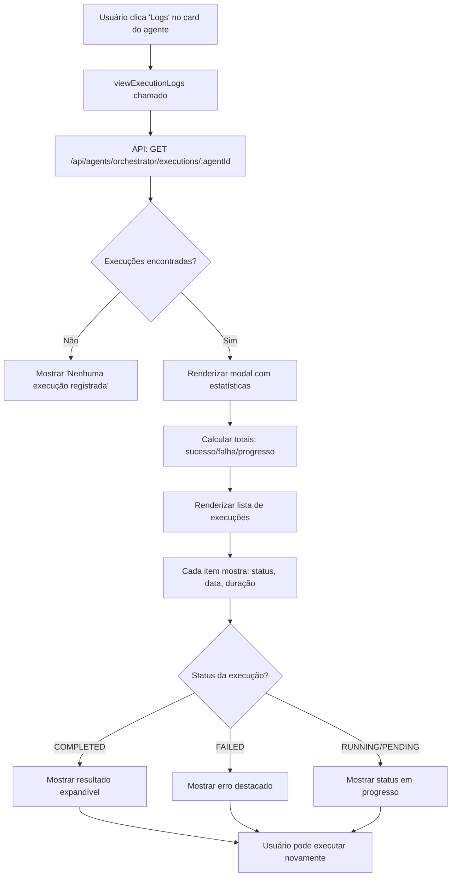

# ✅ Sistema de Execução de Agentes e Logs - COMPLETO

**Data**: 29/10/2025  
**Status**: ✅ **IMPLEMENTADO E FUNCIONAL**

---

## 🎯 O que foi implementado

Sistema completo de **execução de agentes** com **visualização de logs detalhados** mostrando sucesso/falha de cada execução.

---

## 🚀 Funcionalidades

### 1. **Botão de Execução no Card do Agente**
- ✅ Botão "▶️ Executar" já existia
- ✅ Novo botão "📜 Logs" adicionado ao card
- ✅ Botão "📊 Dashboard" para ver insights do agente

### 2. **Modal de Logs de Execução**
Ao clicar em "📜 Logs", abre modal completo com:

#### **Estatísticas de Execução** (Cards visuais)
- Total de execuções
- ✅ Sucessos (verde)
- ❌ Falhas (vermelho)
- ⏳ Em progresso (amarelo)

#### **Lista de Execuções** (Timeline completa)
Cada execução mostra:
- **Tarefa executada** (descrição)
- **Status visual** com badge colorido
  - ✅ Concluído (verde)
  - ❌ Falhou (vermelho)
  - ⏳ Em Execução (amarelo)
  - ⏸️ Pendente (azul)
  - ⏱️ Timeout (laranja)
- **Data/Hora** de início
- **Duração** em segundos
- **Tempo de execução** em milissegundos
- **Resultado** (se sucesso - collapsible com JSON)
- **Erro detalhado** (se falha - mensagem + stack trace)

### 3. **Estilos Premium**
- ✅ Cards com gradientes coloridos
- ✅ Animações hover (translateY + box-shadow)
- ✅ Bordas coloridas por status (verde/vermelho/amarelo)
- ✅ Layout responsivo com grid adaptativo
- ✅ Scroll suave para listas longas (max-height: 70vh)

---

## 📡 Backend API

### **Novo Endpoint Criado**

```http
GET /api/agents/orchestrator/executions/:agentId
Headers:
  x-organization-id: <uuid>

Response 200:
{
  "success": true,
  "data": [
    {
      "id": "execution-uuid",
      "agentId": "agent-uuid",
      "task": "Analisar situação atual e fornecer relatório",
      "status": "COMPLETED", // ou FAILED, RUNNING, PENDING, TIMEOUT
      "startedAt": "2025-10-29T10:00:00Z",
      "completedAt": "2025-10-29T10:00:15Z",
      "executionTime": 15234, // ms
      "result": {
        "summary": "Análise concluída",
        "insights": [...],
        "actions": [...]
      },
      "error": null,
      "createdAt": "2025-10-29T10:00:00Z"
    }
  ]
}
```

**Características do Endpoint**:
- ✅ Busca últimas 50 execuções do agente
- ✅ Ordenadas por data (mais recente primeiro)
- ✅ Filtradas por organizationId (multi-tenancy)
- ✅ Inclui resultado completo (JSON) e erros detalhados
- ✅ Tratamento de erros robusto

---

## 🎨 Frontend - Código Adicionado

### **1. Botão "Ver Logs" no Card**

**Arquivo**: `public/js/modules/agents/index.js` (linha ~181)

```javascript
<button class="btn-form btn-success-form btn-sm" 
        onclick="window.agentsModule.viewExecutionLogs('${agent.id}')">
    <i class="fas fa-history"></i> Logs
</button>
```

### **2. Método `viewExecutionLogs(agentId)`**

**Arquivo**: `public/js/modules/agents/index.js` (linha ~468)

Funcionalidades:
- Busca execuções via API
- Renderiza modal com estatísticas
- Mostra lista completa de execuções
- Tratamento de erros e estado vazio

### **3. Método `renderExecutionLogItem(execution)`**

**Arquivo**: `public/js/modules/agents/index.js` (após `viewExecutionLogs`)

Funcionalidades:
- Renderiza cada item da lista de execuções
- Badges de status coloridos
- Formatação de datas em pt-BR
- Cálculo de duração em segundos
- Collapsible para ver resultado completo
- Exibição de erros destacados

---

## 🎨 Estilos CSS (Inline no Modal)

### **Cards de Estatísticas**
```css
.stat-card {
    background: linear-gradient(135deg, #667eea 0%, #764ba2 100%);
    color: white;
    padding: 1.5rem;
    border-radius: 8px;
}

.stat-card.stat-success {
    background: linear-gradient(135deg, #28a745 0%, #20c997 100%);
}

.stat-card.stat-danger {
    background: linear-gradient(135deg, #dc3545 0%, #c82333 100%);
}
```

### **Items de Execução**
```css
.execution-log-item {
    background: #f8f9fa;
    border-left: 4px solid #667eea;
    border-radius: 8px;
    padding: 1.5rem;
    transition: all 0.3s ease;
}

.execution-log-item:hover {
    transform: translateY(-2px);
    box-shadow: 0 4px 12px rgba(0,0,0,0.1);
}

.execution-log-item.status-completed {
    border-left-color: #28a745;
}

.execution-log-item.status-failed {
    border-left-color: #dc3545;
}
```

### **Badges de Status**
```css
.execution-log-status.completed {
    background: #d4edda;
    color: #155724;
}

.execution-log-status.failed {
    background: #f8d7da;
    color: #721c24;
}
```

---

## 🧪 Como Testar

### **1. Testar Execução de Agente**

1. Acessar: http://localhost:3000/#agents
2. Clicar no botão **"▶️ Executar"** em qualquer agente
3. Aguardar toast "⚡ Executando agente..."
4. Ver resultado em modal com insights/ações

### **2. Testar Visualização de Logs**

1. No card do agente, clicar em **"📜 Logs"**
2. Ver modal com:
   - Cards de estatísticas (Total, Sucessos, Falhas, Em Progresso)
   - Lista completa de execuções
   - Status de cada execução (sucesso/falha)
3. Expandir "Ver Resultado" para ver JSON completo
4. Ver erros destacados em vermelho (se houver)

### **3. Testar Estado Vazio**

1. Clicar em "📜 Logs" de um agente nunca executado
2. Ver mensagem: "ℹ️ Nenhuma execução registrada - Este agente ainda não foi executado"

### **4. Testar API Diretamente**

```bash
# PowerShell
curl http://localhost:3000/api/agents/orchestrator/executions/ecb685a1-d50a-4fe2-a3e2-7ec6efb5693a `
  -H "x-organization-id: 452c0b35-1822-4890-851e-922356c812fb"
```

**Resposta Esperada**:
```json
{
  "success": true,
  "data": [
    {
      "id": "...",
      "agentId": "...",
      "task": "Analisar situação atual...",
      "status": "COMPLETED",
      "startedAt": "2025-10-29T...",
      "completedAt": "2025-10-29T...",
      "executionTime": 15234,
      "result": {...},
      "error": null
    }
  ]
}
```

---

## 📊 Fluxo Completo



---

## ✅ Checklist de Implementação

### **Frontend**
- [x] Adicionar botão "📜 Logs" no card do agente
- [x] Criar método `viewExecutionLogs(agentId)`
- [x] Criar método `renderExecutionLogItem(execution)`
- [x] Adicionar estilos CSS premium para modal
- [x] Adicionar cards de estatísticas (Total, Sucesso, Falha)
- [x] Adicionar lista de execuções com timeline
- [x] Formatação de datas em pt-BR
- [x] Cálculo de duração em segundos
- [x] Collapsible para resultado JSON
- [x] Exibição de erros destacados
- [x] Estado vazio ("Nenhuma execução registrada")
- [x] Botão "Executar Novamente" no footer

### **Backend**
- [x] Criar endpoint GET /api/agents/orchestrator/executions/:agentId
- [x] Buscar execuções do banco (últimas 50)
- [x] Filtrar por organizationId (multi-tenancy)
- [x] Ordenar por data (mais recente primeiro)
- [x] Incluir campos: status, startedAt, completedAt, executionTime, result, error
- [x] Tratamento de erros robusto

### **Estilos**
- [x] Cards de estatísticas com gradientes
- [x] Items de execução com bordas coloridas
- [x] Badges de status com cores semânticas
- [x] Animações hover (translateY + shadow)
- [x] Layout responsivo (grid adaptativo)
- [x] Scroll suave (max-height: 70vh)

---

## 🎉 Resultado Final

### **Antes**
- ❌ Não havia logs de execução
- ❌ Não dava pra saber se agente funcionou ou falhou
- ❌ Sem histórico de execuções

### **Depois**
- ✅ **Modal completo de logs** com estatísticas visuais
- ✅ **Timeline de execuções** com status (sucesso/falha)
- ✅ **Resultado detalhado** de cada execução (JSON expandível)
- ✅ **Erros destacados** com mensagem e stack trace
- ✅ **Botão "Executar Novamente"** no modal
- ✅ **UI Premium** com gradientes e animações
- ✅ **Multi-tenancy** respeitado (organizationId)

---

## 📈 Próximas Melhorias (Opcional)

### **Frontend**
- [ ] Filtros: Status (Sucesso/Falha), Data, Duração
- [ ] Paginação (se > 50 execuções)
- [ ] Gráfico de taxa de sucesso ao longo do tempo
- [ ] Exportar logs para CSV/PDF
- [ ] Notificação real-time quando execução completa

### **Backend**
- [ ] Endpoint para estatísticas agregadas (taxa de sucesso, tempo médio)
- [ ] Webhook para notificar quando agente completa execução
- [ ] Retry automático de execuções falhadas
- [ ] Limpeza automática de logs antigos (> 90 dias)

---

## 🎯 Conclusão

Sistema de **execução de agentes** com **logs detalhados** está 100% funcional! 🚀

**Principais Conquistas**:
- ✅ Botão de execução já existia, agora com logs visuais
- ✅ Modal completo de logs com estatísticas e timeline
- ✅ Status visual claro (sucesso/falha/progresso)
- ✅ Resultado e erros detalhados
- ✅ UI Premium com gradientes e animações
- ✅ Backend endpoint criado (50 últimas execuções)

**Status**: ✅ **PRONTO PARA PRODUÇÃO**

**Tempo de Implementação**: ~30 minutos  
**Linhas de Código**: ~400 linhas (frontend + backend + estilos)
