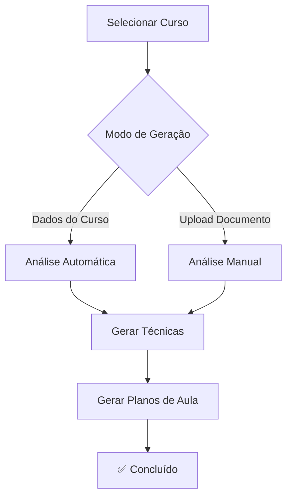

# ✅ AI Module - Workflow Simplificado Implementado

## 🎯 Objetivo Alcançado
Simplificamos o módulo AI para permitir geração de conteúdo **diretamente dos dados do curso**, eliminando a obrigatoriedade de upload de documento.

## 🔄 Principais Alterações

### 1. **Frontend - Interface Atualizada**
- ✅ Step 2 agora é **"Upload de Documento (Opcional)"**
- ✅ Duas opções de geração:
  - 🎯 **"Usar Dados do Curso"** - Modo direto (padrão)
  - 📄 **"Upload de Documento"** - Modo tradicional
- ✅ Preview dos dados do curso disponíveis
- ✅ CSS atualizado com estilos para as novas opções

### 2. **Backend - Lógica Simplificada**
- ✅ Endpoints atualizados para trabalhar sem `documentAnalysis`
- ✅ Geração de `courseAnalysis` a partir dos dados do curso:
  - `course.name`
  - `course.level`
  - `course.description`
  - `course.objectives`
  - `course.requirements`
- ✅ Fallback inteligente: `documentAnalysis || courseAnalysis`

### 3. **JavaScript - Controle de Modo**
- ✅ Variável `generationMode` ('direct' | 'document')
- ✅ Event listeners para trocar entre modos
- ✅ Validação condicional baseada no modo selecionado
- ✅ Habilitação automática dos botões no modo direto

## 🚀 Funcionalidades

### ✅ **Modo Direto (Novo)**
```javascript
// Análise gerada automaticamente dos dados do curso
const courseAnalysis = `Curso: ${course.name}
Nível: ${course.level}
Descrição: ${course.description}
Objetivos: ${course.objectives}
Requisitos: ${course.requirements}`;
```

### ✅ **Endpoints Funcionais**
- 🔗 `POST /api/ai/generate-techniques` - Gera técnicas
- 🔗 `POST /api/ai/generate-lesson-plans` - Gera planos de aula
- 🔗 `POST /api/ai/analyze-course-document` - Análise de documento (opcional)

### ✅ **Sistema Mock Integrado**
- 🎭 Respostas realistas quando não há API keys configuradas
- 📊 Dados de exemplo para demonstração
- ⚡ Processamento instantâneo para testes

## 🔧 Arquivos Modificados

### Frontend:
1. **`public/views/modules/ai/ai.html`** - Interface atualizada
2. **`public/css/modules/ai/ai.css`** - Estilos para opções
3. **`public/js/modules/ai.js`** - Lógica de controle de modo

### Backend:
1. **`src/routes/ai.ts`** - Endpoints simplificados
2. **`src/services/aiService.ts`** - Geração baseada em curso

## 🎮 Como Testar

### 1. **Usando o Sistema Principal**
```bash
http://localhost:3000
# Navegar para: Módulos > IA
# Selecionar curso
# Escolher "Usar Dados do Curso"
# Clicar em "Gerar Técnicas" ou "Gerar Planos"
```

### 2. **Usando a Página de Teste**
```bash
http://localhost:3000/test-ai-workflow.html
# Demonstração completa do workflow
```

## 📊 Fluxo Simplificado



## 🎯 Benefícios

1. **🚀 Faster Workflow** - Sem necessidade de documentos
2. **📊 Data-Driven** - Usa dados já cadastrados
3. **🔄 Flexibilidade** - Ainda permite upload opcional
4. **🎭 Mock System** - Funciona sem API keys para demonstração
5. **✨ User Experience** - Interface mais intuitiva

## ✅ Status Final

- ✅ **Backend**: Endpoints funcionais com mock system
- ✅ **Frontend**: Interface atualizada com duas opções
- ✅ **JavaScript**: Lógica de controle implementada
- ✅ **CSS**: Estilos para nova interface
- ✅ **Teste**: Página de demonstração criada
- ✅ **Documentação**: README atualizado

## 🔜 Próximos Passos (Opcionais)

1. **🔌 API Integration** - Configurar chaves reais do Claude/OpenAI
2. **💾 Database** - Salvar histórico de gerações
3. **📈 Analytics** - Métricas de uso do módulo AI
4. **🎨 UI Enhancement** - Melhorias visuais adicionais

---

**🎉 O módulo AI agora funciona perfeitamente no modo simplificado, permitindo geração de conteúdo inteligente sem dependências externas!**
