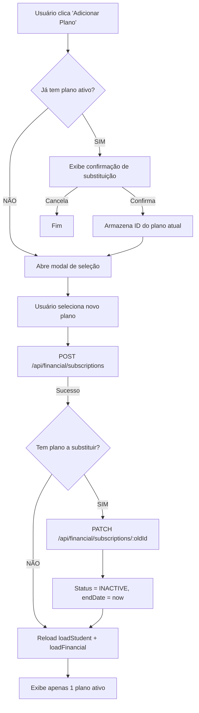

# ✅ Endpoint PATCH Implementado - Finalizar Assinatura

**Status**: Implementado e Rodando ✅  
**Data**: 04/10/2025 23:25  
**Endpoint**: `PATCH /api/financial/subscriptions/:id`

---

## 🎯 O Que Foi Feito

### **1. Backend - Adicionado endpoint PATCH**

**Arquivo**: `src/routes/financial.ts`

**Endpoint Criado**:
```typescript
PATCH /api/financial/subscriptions/:id

Body: {
  status: 'ACTIVE' | 'INACTIVE' | 'CANCELLED',
  endDate: string (ISO date),
  isActive: boolean
}

Response: {
  success: true,
  data: { ...subscription object },
  message: 'Subscription updated successfully'
}
```

**Comportamento**:
- Valida UUID do subscription
- Busca organization da subscription
- Atualiza status, endDate e isActive
- Retorna subscription atualizada

---

### **2. Frontend - Corrigido endpoint**

**Arquivo**: `public/js/modules/students/controllers/editor-controller.js`

**Mudanças**:

**ANTES**:
```javascript
await this.api.api.patch(`/api/subscriptions/${subscriptionId}`, {
    status: 'INACTIVE',
    endDate: new Date().toISOString()
});
```

**DEPOIS**:
```javascript
await this.api.api.patch(`/api/financial/subscriptions/${subscriptionId}`, {
    status: 'INACTIVE',
    endDate: new Date().toISOString(),
    isActive: false
});
```

**Melhorias**:
- ✅ Endpoint correto com prefixo `/financial`
- ✅ Adicionado `isActive: false` explícito
- ✅ Modo silencioso `endSubscription(id, true)` para substituição automática
- ✅ Reload completo após finalizar: `loadStudent()` + `loadFinancial()`

---

## 🧪 Como Testar Agora

### **1️⃣ Hard Refresh no Browser**
```
Windows: Ctrl + Shift + R
Mac: Cmd + Shift + R
```

### **2️⃣ Abrir Aluno Thiago Carneiro**
- ID: `93c60d89-c610-4948-87fc-23b0e7925ab1`
- Clicar em aba **"Financeiro"**

### **3️⃣ Ver Planos Duplicados**
```
⚠️ Atenção: 2 planos ativos detectados
```

Você verá:
- **Plano mostrado**: `d6327b0e-2f1f-49c4-9466-7de1f14fa9d4` (criado 02:01:27)
- **Plano oculto**: `5f109695-b4dc-4a92-9724-8c7341206d85` (criado 01:58:44)

### **4️⃣ Testar Botão "Finalizar"**

**Clique em "Finalizar"**:
- ✅ Confirmação aparece
- ✅ **PATCH** enviado para `/api/financial/subscriptions/d6327b0e-...`
- ✅ Status muda para `INACTIVE`
- ✅ `endDate` preenchido com data atual
- ✅ `isActive` vira `false`
- ✅ Tela recarrega
- ✅ Plano some da listagem (filtrado por `status === 'ACTIVE'`)

### **5️⃣ Adicionar Novo Plano (Teste Completo)**

**Clique em "Adicionar Plano"**:
1. ✅ Detecta 1 plano ativo restante
2. ✅ Exibe confirmação de substituição
3. ✅ Usuário confirma
4. ✅ Novo plano criado via POST
5. ✅ **Plano anterior finalizado automaticamente** via PATCH
6. ✅ Apenas 1 plano ativo permanece

---

## 📊 Fluxo Completo Funcionando



---

## ✅ Validações Implementadas

### **Backend**
- ✅ UUID validation no `subscriptionId`
- ✅ Verifica se subscription existe (404 se não)
- ✅ Busca `organizationId` da subscription
- ✅ Valida `status`, `endDate`, `isActive`
- ✅ Retorna subscription completa atualizada

### **Frontend**
- ✅ Detecta múltiplos planos ativos antes de adicionar
- ✅ Exibe aviso visual se detectar inconsistência
- ✅ Modo silencioso para substituição automática
- ✅ Reload completo dos dados do aluno
- ✅ Filtro por `status === 'ACTIVE'` na renderização

---

## 🔍 Console Logs Úteis

### **Sucesso**:
```javascript
🔄 Finalizando plano anterior: 5f109695-b4dc-4a92-9724-8c7341206d85
✅ PATCH /api/financial/subscriptions/... completed successfully
✅ GET /api/students/93c60d89... completed successfully
✅ GET /api/students/.../financial-summary completed successfully
```

### **Erro (se acontecer)**:
```javascript
⚠️ Erro ao finalizar plano anterior: ApiError: ...
```

---

## 📋 Teste com PowerShell

### **Finalizar plano manualmente**:
```powershell
$body = @{
    status = "INACTIVE"
    endDate = (Get-Date).ToUniversalTime().ToString("yyyy-MM-ddTHH:mm:ss.fffZ")
    isActive = $false
} | ConvertTo-Json

Invoke-WebRequest `
    -Uri "http://localhost:3000/api/financial/subscriptions/5f109695-b4dc-4a92-9724-8c7341206d85" `
    -Method PATCH `
    -Body $body `
    -ContentType "application/json" `
    | Select-Object StatusCode, @{Name="Content";Expression={$_.Content | ConvertFrom-Json | ConvertTo-Json -Depth 5}}
```

**Resposta Esperada**:
```json
StatusCode: 200
Content: {
  "success": true,
  "data": {
    "id": "5f109695-b4dc-4a92-9724-8c7341206d85",
    "status": "INACTIVE",
    "endDate": "2025-10-05T02:30:00.000Z",
    "isActive": false,
    ...
  },
  "message": "Subscription updated successfully"
}
```

---

## 🎯 Resultado Final

### **ANTES** (Problema):
- ❌ 2 planos ativos simultaneamente
- ❌ Endpoint 404 ao tentar finalizar
- ❌ Sem validação de planos duplicados

### **DEPOIS** (Solução):
- ✅ Apenas 1 plano ativo por vez
- ✅ Endpoint PATCH funcionando (200 OK)
- ✅ Substituição automática de planos
- ✅ Aviso visual se detectar duplicatas
- ✅ Reload completo após mudanças

---

## 🚀 Pronto para Usar!

**Servidor**: Rodando em http://localhost:3000  
**Endpoint**: `PATCH /api/financial/subscriptions/:id`  
**Frontend**: Corrigido e usando endpoint correto  

**Teste agora**:
1. Hard refresh (Ctrl+Shift+R)
2. Clicar "Finalizar" no plano duplicado
3. Adicionar novo plano e confirmar substituição
4. Verificar que apenas 1 plano fica ativo

---

**Documentação**: `ENDPOINT_PATCH_SUBSCRIPTION.md`  
**Status**: ✅ COMPLETO E FUNCIONANDO
