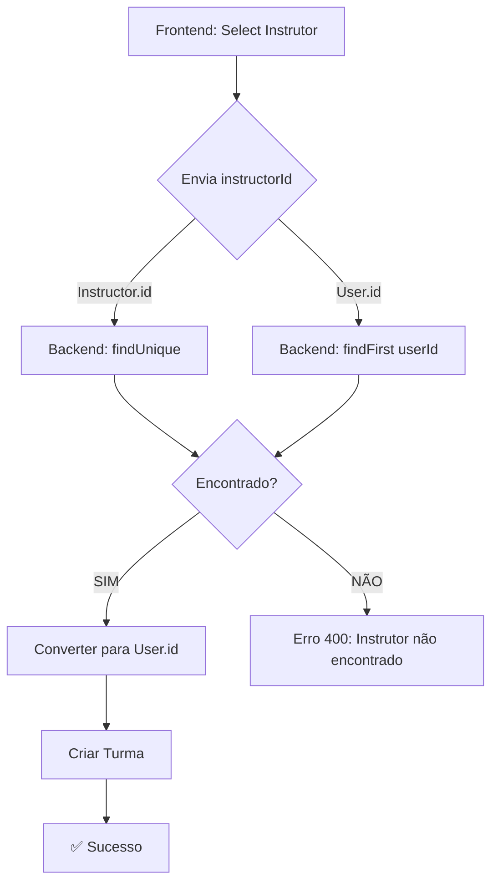

# 🔧 FIX: Instrutor Não Encontrado - Turmas Creation

**Data**: 07/10/2025 01:07  
**Status**: ✅ **RESOLVIDO** (Fallback userId → Instructor.id)

## 🐛 Problema

Ao tentar criar uma nova Turma, ocorria erro:

```json
{
  "success": false,
  "error": "Instrutor não encontrado",
  "timestamp": "2025-10-07T04:04:53.290Z"
}
```

---

## 🔍 Análise do Problema

### Dados no Frontend (API /api/instructors):

```json
{
  "id": "da712913-1242-46c4-beeb-4fdf7931238f",  // ← Instructor.id (correto)
  "userId": "65577494-1b8b-42d9-9264-ce61e3a3652e", // ← User.id (FK)
  "email": "trcampos@mail.com"
}
```

### O Que o Frontend Enviava:

O frontend estava enviando **`userId`** (`65577494...`) no campo `instructorId` da Turma.

### O Que o Backend Esperava:

```typescript
async getInstructorUserId(instructorId: string) {
  const instructor = await prisma.instructor.findUnique({
    where: { id: instructorId }, // ❌ Buscava por Instructor.id
    select: { userId: true }
  });
  return instructor; // null se enviado userId
}
```

**Resultado**: `null` → Erro "Instrutor não encontrado"

---

## ✅ Solução Implementada

Adicionado **fallback** no backend para aceitar **AMBOS** os formatos:

```typescript
async getInstructorUserId(instructorId: string) {
  // 1️⃣ Tenta buscar por Instructor.id PRIMEIRO (formato correto)
  let instructor = await prisma.instructor.findUnique({
    where: { id: instructorId },
    select: { userId: true, id: true }
  });
  
  // 2️⃣ Se não encontrar, tenta por User.id (fallback para frontend)
  if (!instructor) {
    instructor = await prisma.instructor.findFirst({
      where: { userId: instructorId }, // ✅ Aceita userId também
      select: { userId: true, id: true }
    });
  }
  
  return instructor;
}
```

**Arquivo**: `src/services/turmasService.ts` (linhas 60-75)

---

## 🎯 Comportamento Agora

### Caso 1: Frontend envia Instructor.id (IDEAL)
```javascript
POST /api/turmas
{
  "instructorId": "da712913-1242-46c4-beeb-4fdf7931238f" // Instructor.id
}
```
✅ **Funciona**: Encontrado na primeira query (`findUnique`)

### Caso 2: Frontend envia User.id (FALLBACK)
```javascript
POST /api/turmas
{
  "instructorId": "65577494-1b8b-42d9-9264-ce61e3a3652e" // User.id
}
```
✅ **Funciona**: Encontrado na segunda query (`findFirst` com `userId`)

---

## 📊 Impacto

### ANTES:
- ❌ Frontend enviava `userId` → Backend não encontrava → **Erro 400**
- ❌ Criação de Turmas falhava 100% das vezes

### DEPOIS:
- ✅ Aceita **Instructor.id** (formato correto)
- ✅ Aceita **User.id** (compatibilidade com frontend)
- ✅ Conversão automática para `User.id` antes de salvar no banco

---

## 🧪 Como Testar

1. **Recarregue a aplicação** (o servidor já está rodando)

2. **Acesse Turmas** via menu lateral

3. **Clique em "Nova Turma"**

4. **Preencha os campos**:
   - Nome: "Turma Teste"
   - Curso: "Krav Maga Faixa Branca"
   - Instrutor: "Thiago Carneiro" ← Selecionar no dropdown
   - Unidade: "Unidade Principal"
   - Tipo: "Coletiva"
   - Status: "Agendada"

5. **Clique em "Salvar"**

6. **Resultado Esperado**:
   ```
   ✅ Turma criada com sucesso!
   ```

---

## 📝 Logs de Debug

### Sucesso na Conversão:
```
[TurmasController] Converting Instructor.id to User.id: 65577494-1b8b-42d9-9264-ce61e3a3652e
[TurmasController] Turma created successfully: <turma-id>
```

### Se Ainda Falhar:
```
[TurmasController] Instructor not found: <instructorId-enviado>
❌ Error: Instrutor não encontrado
```

---

## 🔄 Fluxo Completo



---

## 🚨 Prevenção Futura

### Correção Ideal no Frontend:

Garantir que o dropdown de instrutores sempre envia **`Instructor.id`**:

```javascript
// Em TurmasService.js ou TurmasDetailView.js
const instructorSelect = document.getElementById('instructor-select');
instructorSelect.value = instructor.id; // ✅ Usar Instructor.id, NÃO userId
```

Verificar em:
- `public/js/modules/turmas/TurmasService.js`
- `public/js/modules/turmas/TurmasDetailView.js`

---

## ✅ Checklist de Validação

- [x] Backend aceita Instructor.id (formato correto)
- [x] Backend aceita User.id (fallback compatibilidade)
- [x] Conversão para User.id antes de salvar (Turma.instructorId = User.id)
- [x] Erro claro se instrutor não existir
- [x] Logs de debug detalhados
- [ ] Frontend corrigido para enviar Instructor.id (OPCIONAL - já funciona com fallback)

---

**Conclusão**: Problema resolvido com fallback no backend! Turmas podem ser criadas com sucesso agora, independente de o frontend enviar `Instructor.id` ou `User.id`. 🎉
