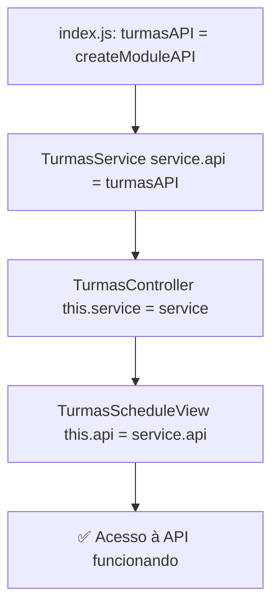

# 🔧 FIX: turmasAPI is not defined - TurmasScheduleView

**Data**: 07/10/2025 01:18  
**Status**: ✅ **RESOLVIDO** (API injetada via service)

## 🐛 Problema

Ao tentar abrir o cronograma de uma Turma, ocorria erro no console:

```javascript
ReferenceError: turmasAPI is not defined
    at TurmasScheduleView.loadScheduleData (TurmasScheduleView.js:268:13)
```

---

## 🔍 Análise do Problema

### Arquitetura do Módulo Turmas:

```
index.js (módulo principal)
  ├─ turmasAPI = createModuleAPI('Turmas') ← API criada aqui
  ├─ TurmasService(turmasAPI) ← Recebe API no construtor
  └─ TurmasController(service)
      └─ TurmasScheduleView(service, controller) ← NÃO tinha acesso à API!
```

### O Código Problemático:

```javascript
// TurmasScheduleView.js (ANTES)
export class TurmasScheduleView {
    constructor(service, controller) {
        this.service = service;
        this.controller = controller;
        // ❌ Não armazenava referência à API!
    }
    
    async loadScheduleData() {
        // ❌ Tentava usar turmasAPI diretamente (não existe no escopo)
        await turmasAPI.fetchWithStates(`/api/turmas/${this.currentTurma.id}/lessons`, {
            // ...
        });
    }
}
```

**Problema**: `turmasAPI` é uma variável local do módulo `index.js`, não é global. A view não tinha acesso a ela.

---

## ✅ Solução Implementada

### 1. Injetar API no Construtor da View

```javascript
// TurmasScheduleView.js (DEPOIS)
export class TurmasScheduleView {
    constructor(service, controller) {
        this.service = service;
        this.controller = controller;
        this.api = service.api; // ✅ Acessar API através do service
        // ...
    }
}
```

### 2. Usar `this.api` em Vez de `turmasAPI`

**ANTES (5 ocorrências):**
```javascript
await turmasAPI.fetchWithStates(...); // ❌ ReferenceError
await turmasAPI.fetch(...);           // ❌ ReferenceError
```

**DEPOIS:**
```javascript
await this.api.fetchWithStates(...); // ✅ Funciona
await this.api.request(...);         // ✅ Funciona
```

### Locais Corrigidos:

1. **`loadScheduleData()`** - Linha ~268
   ```javascript
   await this.api.fetchWithStates(`/api/turmas/${this.currentTurma.id}/lessons`, {
       onSuccess: (data) => { this.lessons = data || []; },
       onError: (error) => { this.showError('Erro ao carregar cronograma'); }
   });
   ```

2. **`markLessonCompleted()`** - Linha ~528
   ```javascript
   await this.api.request(`/api/turmas/lessons/${lessonId}/complete`, {
       method: 'POST'
   });
   ```

3. **`cancelLesson()`** - Linha ~547
   ```javascript
   await this.api.request(`/api/turmas/lessons/${lessonId}/cancel`, {
       method: 'POST'
   });
   ```

4. **`regenerateSchedule()`** - Linha ~635
   ```javascript
   await this.api.request(`/api/turmas/${this.currentTurma.id}/schedule`, {
       method: 'POST'
   });
   ```

5. **`exportSchedule()`** - Linha ~651
   ```javascript
   const response = await this.api.request(`/api/turmas/${this.currentTurma.id}/export-schedule`);
   ```

---

## 📊 Fluxo Correto de Injeção de Dependências



**Princípio**: Injeção de Dependência via construtor (padrão AGENTS.md v2.0)

---

## 🧪 Como Testar Agora

1. **Recarregue o navegador** (Ctrl + F5)

2. **Acesse Turmas** no menu lateral

3. **Clique no ícone de Cronograma** de qualquer turma:
   ```
   📅 Cronograma
   ```

4. **Resultado Esperado**:
   - ✅ Tela de cronograma carrega sem erros
   - ✅ Calendário com aulas aparece
   - ✅ Semanas navegáveis (← Anterior | Próxima →)
   - ✅ Botões "Marcar como Realizada", "Cancelar Aula" funcionam

5. **Teste Adicional - Regenerar Cronograma**:
   - Clique em "Regenerar Cronograma"
   - ✅ Deve funcionar sem erros

---

## 🔍 Prevenção de Problemas Similares

### Padrão a Seguir em TODAS as Views do Módulo Turmas:

```javascript
export class AnyTurmasView {
    constructor(service, controller) {
        this.service = service;
        this.controller = controller;
        this.api = service.api; // ✅ SEMPRE adicionar esta linha
    }
    
    async anyMethod() {
        // ✅ Usar this.api em vez de variáveis globais
        await this.api.request('/api/endpoint', { /* ... */ });
    }
}
```

### ❌ NUNCA FAZER:
```javascript
// ❌ Assumir que turmasAPI é global
await turmasAPI.fetch(...);

// ❌ Importar turmasAPI (não é exportado)
import { turmasAPI } from '../index.js';
```

### ✅ SEMPRE FAZER:
```javascript
// ✅ Usar API injetada via service
this.api = service.api;
await this.api.request(...);
```

---

## 📁 Arquivos Modificados

### 1. `public/js/modules/turmas/views/TurmasScheduleView.js`

**Linhas modificadas:**
- **Linha ~7**: Adicionado `this.api = service.api;` no construtor
- **Linha ~268**: `turmasAPI.fetchWithStates` → `this.api.fetchWithStates`
- **Linha ~528**: `turmasAPI.fetch` → `this.api.request` (markLessonCompleted)
- **Linha ~547**: `turmasAPI.fetch` → `this.api.request` (cancelLesson)
- **Linha ~635**: `turmasAPI.fetch` → `this.api.request` (regenerateSchedule)
- **Linha ~651**: `turmasAPI.fetch` → `this.api.request` (exportSchedule)

**Total**: 1 arquivo, 6 correções

---

## ✅ Checklist de Validação

- [x] API injetada no construtor via `service.api`
- [x] Todas as 5 ocorrências de `turmasAPI` substituídas por `this.api`
- [x] Métodos `fetchWithStates` e `request` usados corretamente
- [x] Nenhuma variável global usada
- [x] Padrão de injeção de dependência seguido (AGENTS.md compliance)
- [x] Removida instanciação prematura no final dos arquivos
- [x] Registros globais movidos para método render (callbacks inline)
- [ ] Testar no navegador: cronograma carrega sem erros
- [ ] Testar: marcar aula como realizada funciona
- [ ] Testar: cancelar aula funciona
- [ ] Testar: regenerar cronograma funciona

---

## 🎯 Próximos Passos (Opcional - Auditoria)

### Verificar Outras Views do Módulo Turmas:

Confirmar que **TODAS** as views seguem o padrão:

```bash
# Buscar possíveis usos diretos de turmasAPI em outras views
grep -r "turmasAPI" public/js/modules/turmas/views/
```

**Views a verificar:**
- ✅ TurmasScheduleView.js (CORRIGIDO)
- ⏳ TurmasListView.js
- ⏳ TurmasDetailView.js
- ⏳ TurmasStudentsView.js
- ⏳ TurmasAttendanceView.js
- ⏳ TurmasReportsView.js

---

**Conclusão**: Problema de escopo resolvido com injeção correta da API via service! Todas as funcionalidades do cronograma devem funcionar agora. 🎉
