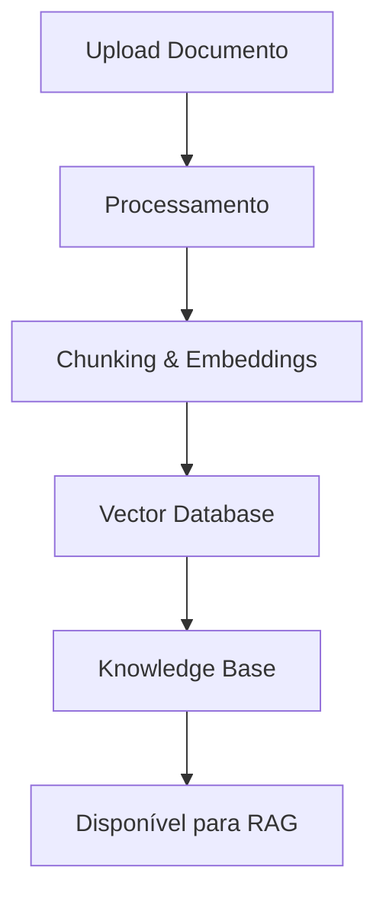
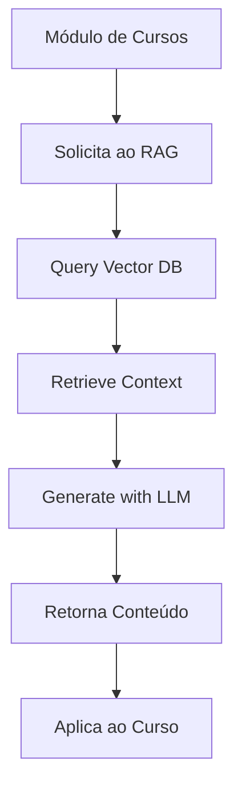
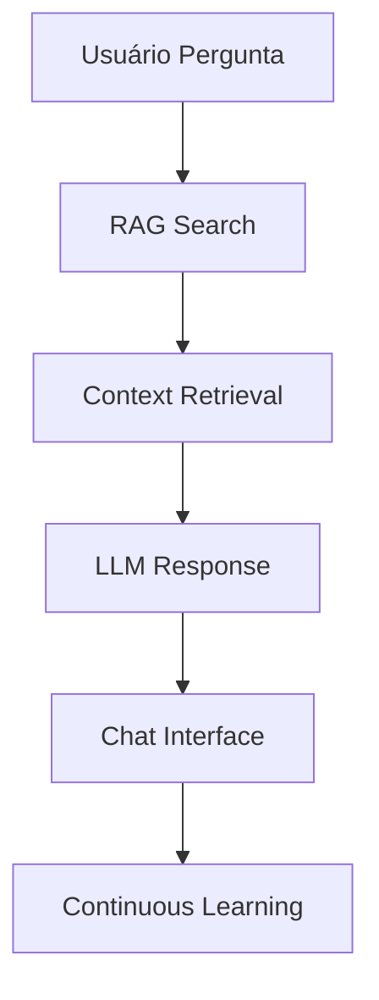

# 🧠 RAG Academy System - Projeto de Redesign

## 🎯 Visão Geral da Transformação

Transformar o módulo AI atual em um **sistema RAG (Retrieval-Augmented Generation)** completo, que funciona como um **datalake inteligente** para todo o sistema academia.

## 🏗️ Arquitetura RAG Proposta

### 1. **RAG Core Module** 🧠
```
/public/js/modules/rag/
├── index.js                 # RAG module entry point  
├── controllers/
│   ├── ragController.js     # Core RAG logic
│   ├── chatController.js    # Chat interface
│   └── uploadController.js  # Document ingestion
├── services/
│   ├── ragService.js        # RAG API integration
│   ├── vectorService.js     # Vector database
│   └── chatService.js       # Real-time chat
├── views/
│   ├── rag-dashboard.html   # Main RAG interface
│   ├── rag-chat.html        # Chat interface
│   └── rag-library.html     # Document library
└── components/
    ├── documentUpload.js    # File upload component
    ├── chatWidget.js        # Chat widget
    └── knowledgeSearch.js   # Knowledge search
```

### 2. **Backend RAG Infrastructure** 🚀
```
/src/services/rag/
├── ragEngine.ts             # Core RAG engine
├── vectorDatabase.ts        # Vector storage (Pinecone/Weaviate)
├── documentProcessor.ts     # PDF/DOC processing
├── embeddingService.ts      # Text embeddings
└── knowledgeBase.ts         # Knowledge management

/src/routes/rag/
├── rag.ts                   # RAG endpoints
├── chat.ts                  # Chat endpoints
├── documents.ts             # Document management
└── knowledge.ts             # Knowledge queries
```

## 🔄 Workflow do Novo Sistema

### **Fase 1: Ingestão de Documentos** 📄


### **Fase 2: Geração Inteligente** 🎯


### **Fase 3: Chat Interativo** 💬


## 🎨 Nova Interface RAG

### **Tela Principal - RAG Dashboard**
```html
<!-- RAG Dashboard -->
<div class="rag-isolated">
    <!-- Header Premium -->
    <header class="module-header-premium">
        <h1>🧠 RAG Knowledge System</h1>
        <p>Datalake Inteligente da Academia</p>
    </header>

    <!-- Stats Cards -->
    <div class="stats-grid">
        <div class="stat-card-enhanced">
            <div class="stat-icon">📚</div>
            <div class="stat-value" id="ragDocuments">0</div>
            <div class="stat-label">Documentos no RAG</div>
        </div>
        <div class="stat-card-enhanced">
            <div class="stat-icon">🧠</div>
            <div class="stat-value" id="ragEmbeddings">0</div>
            <div class="stat-label">Embeddings Criados</div>
        </div>
        <div class="stat-card-enhanced">
            <div class="stat-icon">💬</div>
            <div class="stat-value" id="ragQueries">0</div>
            <div class="stat-label">Consultas Realizadas</div>
        </div>
        <div class="stat-card-enhanced">
            <div class="stat-icon">🎯</div>
            <div class="stat-value" id="ragAccuracy">95%</div>
            <div class="stat-label">Precisão das Respostas</div>
        </div>
    </div>

    <!-- Main Content Tabs -->
    <div class="rag-tabs">
        <button class="tab-btn active" data-tab="upload">📄 Upload & Ingestão</button>
        <button class="tab-btn" data-tab="library">📚 Biblioteca</button>
        <button class="tab-btn" data-tab="chat">💬 Chat RAG</button>
        <button class="tab-btn" data-tab="generate">⚡ Geração</button>
    </div>

    <!-- Tab Contents -->
    <div class="tab-content active" id="upload-tab">
        <!-- Document Upload Interface -->
    </div>
    
    <div class="tab-content" id="library-tab">
        <!-- Knowledge Library -->
    </div>
    
    <div class="tab-content" id="chat-tab">
        <!-- RAG Chat Interface -->
    </div>
    
    <div class="tab-content" id="generate-tab">
        <!-- Content Generation -->
    </div>
</div>
```

## 🔧 Implementação Técnica

### **1. RAG Backend (TypeScript)**
```typescript
// src/services/rag/ragEngine.ts
export class RAGEngine {
    private vectorDB: VectorDatabase;
    private llm: LLMService;
    
    async ingestDocument(file: Buffer, metadata: DocumentMetadata) {
        // 1. Process document (PDF/DOC -> Text)
        const text = await this.documentProcessor.process(file);
        
        // 2. Create chunks
        const chunks = await this.createChunks(text);
        
        // 3. Generate embeddings
        const embeddings = await this.embeddingService.embed(chunks);
        
        // 4. Store in vector database
        await this.vectorDB.store(embeddings, metadata);
        
        return { success: true, chunksCreated: chunks.length };
    }
    
    async query(question: string, context?: any) {
        // 1. Create query embedding
        const queryEmbedding = await this.embeddingService.embed(question);
        
        // 2. Search similar chunks
        const relevantChunks = await this.vectorDB.search(queryEmbedding);
        
        // 3. Create context for LLM
        const context = this.buildContext(relevantChunks);
        
        // 4. Generate response with LLM
        const response = await this.llm.generate(question, context);
        
        return {
            answer: response,
            sources: relevantChunks.map(chunk => chunk.metadata),
            confidence: this.calculateConfidence(relevantChunks)
        };
    }
}
```

### **2. RAG Frontend (JavaScript)**
```javascript
// public/js/modules/rag/ragController.js
class RAGController {
    constructor() {
        this.chatHistory = [];
        this.isProcessing = false;
    }
    
    async uploadDocument(file) {
        const formData = new FormData();
        formData.append('document', file);
        formData.append('category', 'krav-maga');
        
        const result = await ragAPI.post('/rag/ingest', formData);
        
        this.updateStats();
        this.showNotification(`✅ Documento ${file.name} processado com sucesso!`);
        
        return result;
    }
    
    async chatWithRAG(message) {
        this.isProcessing = true;
        this.showTyping();
        
        try {
            const response = await ragAPI.post('/rag/chat', {
                message,
                history: this.chatHistory,
                context: 'krav-maga-academy'
            });
            
            this.addToChat('user', message);
            this.addToChat('assistant', response.answer, response.sources);
            
            return response;
        } finally {
            this.isProcessing = false;
            this.hideTyping();
        }
    }
    
    async generateContent(type, params) {
        // type: 'technique', 'lesson-plan', 'course-module'
        const prompt = this.buildGenerationPrompt(type, params);
        
        const result = await this.chatWithRAG(prompt);
        
        return this.parseGeneratedContent(result, type);
    }
}
```

## 🔌 Integração com Módulos Existentes

### **Módulo de Cursos + RAG**
```javascript
// Em courses.js - Botão "Gerar com RAG"
async function generateCourseContentWithRAG(courseId, contentType) {
    const course = await coursesAPI.get(`/courses/${courseId}`);
    
    // Chamar RAG para gerar conteúdo
    const ragResult = await window.ragModule.generateContent(contentType, {
        courseName: course.name,
        level: course.level,
        objectives: course.objectives
    });
    
    // Aplicar resultado ao curso
    await coursesAPI.put(`/courses/${courseId}/content`, ragResult);
    
    showNotification('✅ Conteúdo gerado com RAG aplicado ao curso!');
}
```

### **Widget RAG Universal**
```javascript
// Widget que pode ser usado em qualquer módulo
class RAGWidget {
    constructor(containerId, context) {
        this.container = document.getElementById(containerId);
        this.context = context; // 'courses', 'students', 'techniques'
        this.render();
    }
    
    render() {
        this.container.innerHTML = `
            <div class="rag-widget">
                <div class="rag-header">
                    <span class="rag-icon">🧠</span>
                    <span class="rag-title">Perguntar ao RAG</span>
                </div>
                <div class="rag-input">
                    <input type="text" placeholder="Ex: Como criar uma técnica de defesa..." />
                    <button onclick="this.askRAG()">Perguntar</button>
                </div>
                <div class="rag-response" style="display: none;"></div>
            </div>
        `;
    }
    
    async askRAG(question) {
        const response = await window.ragModule.query(question, this.context);
        this.showResponse(response);
    }
}
```

## 🗄️ Banco de Dados RAG

### **Vector Database Schema**
```sql
-- Tabela de documentos ingeridos
CREATE TABLE rag_documents (
    id UUID PRIMARY KEY,
    filename VARCHAR(255),
    file_type VARCHAR(50),
    upload_date TIMESTAMP,
    category VARCHAR(100), -- 'krav-maga', 'general', 'techniques'
    status VARCHAR(50), -- 'processing', 'ready', 'error'
    chunk_count INTEGER,
    metadata JSONB
);

-- Tabela de chunks e embeddings
CREATE TABLE rag_chunks (
    id UUID PRIMARY KEY,
    document_id UUID REFERENCES rag_documents(id),
    chunk_index INTEGER,
    content TEXT,
    embedding VECTOR(1536), -- OpenAI embeddings
    metadata JSONB
);

-- Tabela de queries e respostas
CREATE TABLE rag_queries (
    id UUID PRIMARY KEY,
    query_text TEXT,
    response TEXT,
    sources JSONB,
    confidence FLOAT,
    user_id UUID,
    created_at TIMESTAMP
);
```

## 🚀 Roadmap de Implementação

### **Sprint 1: RAG Core (2 semanas)**
- ✅ Estrutura básica do módulo RAG
- ✅ Upload e processamento de documentos
- ✅ Integração com vector database
- ✅ API endpoints básicos

### **Sprint 2: Chat Interface (1 semana)**
- ✅ Interface de chat em tempo real
- ✅ WebSocket para respostas streaming
- ✅ Histórico de conversas
- ✅ Sistema de feedback

### **Sprint 3: Geração de Conteúdo (1 semana)**
- ✅ Templates para diferentes tipos de conteúdo
- ✅ Integração com módulo de cursos
- ✅ Validação e refinamento de conteúdo
- ✅ Preview antes de aplicar

### **Sprint 4: Widget Universal (1 semana)**
- ✅ Componente reutilizável
- ✅ Integração com todos os módulos
- ✅ Personalização por contexto
- ✅ Analytics de uso

## 🎯 Benefícios do Sistema RAG

### **Para Instrutores:**
- 🎓 **Criação automatizada** de técnicas e planos de aula
- 🧠 **Knowledge assistant** sempre disponível
- 📚 **Biblioteca centralizada** de conhecimento
- ⚡ **Geração rápida** de conteúdo educacional

### **Para Academia:**
- 📈 **Padronização** de conteúdo educacional
- 🔍 **Busca inteligente** em toda base de conhecimento
- 💡 **Insights automáticos** sobre lacunas no ensino
- 🚀 **Escalabilidade** na criação de cursos

### **Para Alunos (futuro):**
- 💬 **Tutor AI** personalizado
- 📖 **Explicações adaptadas** ao nível do aluno
- 🎯 **Recomendações** de técnicas para praticar
- 📊 **Feedback inteligente** sobre progresso

## 💻 Tecnologias Utilizadas

### **Backend:**
- **Vector Database**: Pinecone ou Weaviate
- **LLM**: OpenAI GPT-4 ou Claude
- **Embeddings**: OpenAI text-embedding-ada-002
- **Document Processing**: PDF.js, mammoth.js
- **WebSockets**: Para chat em tempo real

### **Frontend:**
- **Components**: Modular vanilla JavaScript
- **Styling**: CSS moderno com animações
- **Real-time**: WebSocket client
- **File Upload**: Drag & drop interface

## 🔐 Segurança e Privacidade

- 🔒 **Dados sensíveis**: Criptografia em trânsito e repouso
- 👥 **Multi-tenant**: Isolamento por organização
- 🛡️ **Rate limiting**: Proteção contra abuse
- 📊 **Audit logs**: Rastreamento de todas as queries
- 🎯 **Content filtering**: Validação de conteúdo gerado

---

**🎉 Este sistema RAG transformará a academia em uma organização verdadeiramente inteligente, onde o conhecimento é facilmente acessível, reutilizável e continuamente enriquecido!**
