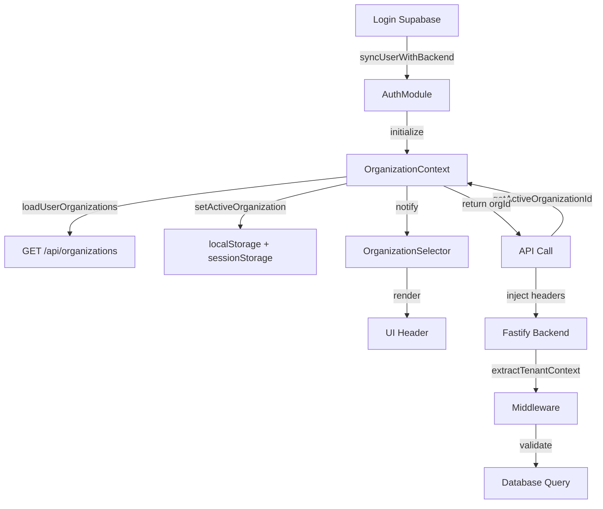

# 🏢 Sistema de Gerenciamento de Organizações - Multi-tenancy

## Visão Geral

Sistema centralizado para gerenciar o contexto de organização ativa em toda a aplicação. Resolve o problema de múltiplas fontes de verdade (`localStorage`, `sessionStorage`, `window.currentOrganizationId`) e garante que todos os dados criados/editados estejam associados à organização correta.

## Arquitetura

### 1. OrganizationContext (Core)
**Arquivo**: `public/js/core/organization-context.js`

Gerenciador centralizado singleton que mantém o estado da organização ativa.

**Responsabilidades**:
- Carregar organizações do usuário
- Resolver organização ativa (prioridades bem definidas)
- Validar acesso do usuário
- Persistir estado em storage
- Notificar mudanças via eventos
- Fornecer API consistente

**API Principal**:
```javascript
// Inicializar (chamado automaticamente no login)
await window.OrganizationContext.initialize(user);

// Obter organização ativa
const orgId = window.OrganizationContext.getActiveOrganizationId();
const orgSlug = window.OrganizationContext.getActiveOrganizationSlug();
const orgData = window.OrganizationContext.getActiveOrganizationData();

// Trocar organização
await window.OrganizationContext.setActiveOrganization(newOrgId);

// Listar organizações do usuário
const orgs = window.OrganizationContext.getUserOrganizations();

// Verificar múltiplas organizações
const hasMultiple = window.OrganizationContext.hasMultipleOrganizations();

// Escutar mudanças
const unsubscribe = window.OrganizationContext.addListener((event) => {
  console.log('Organization changed:', event);
});

// Headers para API calls
const headers = window.OrganizationContext.getApiHeaders();
// { 'X-Organization-Id': 'abc-123', 'X-Organization-Slug': 'academia' }
```

**Helpers globais**:
```javascript
window.getOrganizationId()   // Shortcut para getActiveOrganizationId()
window.getOrganizationSlug() // Shortcut para getActiveOrganizationSlug()
window.getOrganizationData() // Shortcut para getActiveOrganizationData()
```

### 2. OrganizationSelector (UI Component)
**Arquivo**: `public/js/components/organization-selector.js`

Componente visual para seleção de organização no header.

**Features**:
- Exibição simples quando usuário tem apenas 1 organização
- Dropdown elegante quando usuário tem múltiplas organizações
- Troca de organização com reload automático
- Design premium seguindo `DESIGN_SYSTEM.md`
- Responsivo (mobile-friendly)

**Uso**:
```html
<!-- No HTML (index.html) -->
<div id="organization-selector-container"></div>

<!-- Auto-inicializa via DOMContentLoaded -->
```

**CSS**:
```html
<link rel="stylesheet" href="css/components/organization-selector.css">
```

### 3. Integração com API Client
**Arquivo**: `public/js/shared/api-client.js`

API client agora usa OrganizationContext como fonte primária:

**Prioridade de resolução**:
1. `window.OrganizationContext.getActiveOrganizationId()`
2. `localStorage.getItem('activeOrganizationId')`
3. `sessionStorage.getItem('activeOrganizationId')`
4. `window.currentOrganizationId`

**Headers injetados automaticamente**:
```javascript
{
  'X-Organization-Id': 'ff5ee00e-d8a3-4291-9428-d28b852fb472',
  'X-Organization-Slug': 'smart-defence',
  'Authorization': 'Bearer ...'
}
```

### 4. Backend Middleware
**Arquivo**: `src/middlewares/tenant.ts`

Middleware do Fastify que extrai e valida organização:

**Prioridade de resolução**:
1. `request.user.organizationId` (JWT auth)
2. `request.headers['x-organization-id']` (header explícito)
3. Subdomain mapping (SaaS mode)

**Override em desenvolvimento**:
```typescript
// Substitui IDs incorretos por Smart Defence
const wrongIds = ['452c0b35-1822-4890-851e-922356c812fb'];
if (isDevelopment && wrongIds.includes(organizationId)) {
  organizationId = 'ff5ee00e-d8a3-4291-9428-d28b852fb472';
}
```

## Fluxo de Dados



## Estrutura de Arquivos

```
public/
├── js/
│   ├── core/
│   │   ├── organization-context.js     # ⭐ Context Manager
│   │   └── app.js                      # App initialization
│   ├── components/
│   │   └── organization-selector.js    # 🏢 UI Component
│   ├── shared/
│   │   └── api-client.js              # HTTP client (integrado)
│   └── modules/
│       └── auth/
│           └── index.js               # Auth integration
├── css/
│   └── components/
│       └── organization-selector.css  # Component styles
└── index.html                         # HTML entry point

src/
└── middlewares/
    └── tenant.ts                      # Backend middleware
```

## Guia de Migração de Módulos

### Antes (❌ Múltiplas fontes de verdade)
```javascript
// Código legacy inconsistente
const orgId = localStorage.getItem('organizationId') || 
              localStorage.getItem('activeOrganizationId') ||
              window.currentOrganizationId;
```

### Depois (✅ Fonte única de verdade)
```javascript
// Usar OrganizationContext
const orgId = window.OrganizationContext.getActiveOrganizationId();

// Ou helper global
const orgId = window.getOrganizationId();
```

### Em API Calls
```javascript
// API client injeta automaticamente - NADA A FAZER!
const response = await moduleAPI.request('/api/students', {
  method: 'GET'
});
// Headers já incluem X-Organization-Id automaticamente
```

### Escutar Mudanças de Organização
```javascript
// No módulo init()
window.OrganizationContext.addListener((event) => {
  if (event.event === 'changed') {
    console.log('Organization changed to:', event.orgId);
    // Recarregar dados do módulo
    this.loadData();
  }
});
```

## Validações de Segurança

### Frontend
1. **Validação de acesso**: Usuário só vê organizações que possui acesso
2. **Troca bloqueada**: Não pode trocar para organização sem permissão
3. **Fallback seguro**: Em desenvolvimento usa Smart Defence

### Backend
1. **Middleware de tenant**: Valida organizationId em todas as rotas
2. **Foreign key constraints**: Banco valida relacionamentos
3. **Query scoping**: Todas as queries filtram por organizationId

```typescript
// Exemplo: Rota protegida
fastify.get('/api/students', async (request, reply) => {
  const orgId = request.tenant?.organizationId; // Do middleware
  
  const students = await prisma.student.findMany({
    where: { organizationId: orgId } // Scope automático
  });
  
  return { success: true, data: students };
});
```

## Casos de Uso

### 1. Usuário com Uma Organização
- Seletor mostra nome da organização (não-interativo)
- OrganizationContext sempre retorna mesma organização
- Experiência simplificada

### 2. Usuário com Múltiplas Organizações
- Seletor mostra dropdown com todas as organizações
- Usuário pode trocar entre organizações
- Sistema recarrega página para aplicar novo contexto
- Última seleção persiste em localStorage

### 3. Super Admin
- Acesso a todas as organizações do sistema
- Pode trocar livremente entre organizações
- Útil para suporte técnico

### 4. Desenvolvimento Local
- Fallback para Smart Defence (`ff5ee00e-...`)
- Override automático de IDs incorretos
- Logs detalhados para debug

## Troubleshooting

### Problema: organizationId é `null` ou `undefined`
**Causa**: OrganizationContext não foi inicializado
**Solução**:
```javascript
// Aguardar inicialização
const checkContext = setInterval(() => {
  if (window.OrganizationContext?.isInitialized) {
    clearInterval(checkContext);
    const orgId = window.getOrganizationId();
    // Usar orgId...
  }
}, 100);
```

### Problema: Foreign key constraint violated
**Causa**: Tentando criar registro com organizationId inexistente
**Solução**:
1. Verificar se organização existe: `npx tsx check-org-exists.ts`
2. Verificar logs do middleware tenant (backend)
3. Validar headers HTTP no Network tab

### Problema: Usuário não vê organização no seletor
**Causa**: Relacionamento User ↔ Organization faltando
**Solução**:
```sql
-- Criar relacionamento no banco
INSERT INTO UserOrganization (userId, organizationId, role)
VALUES ('user-id-here', 'org-id-here', 'ADMIN');
```

### Problema: Seletor não aparece no header
**Causa 1**: Container HTML faltando
```html
<!-- Adicionar em index.html -->
<div id="organization-selector-container"></div>
```

**Causa 2**: Scripts não carregados
```html
<!-- Verificar ordem de carregamento -->
<script src="js/core/organization-context.js"></script>
<script src="js/components/organization-selector.js"></script>
```

## Performance

### Otimizações Implementadas
1. **Lazy loading**: Organizações carregadas apenas no login
2. **Cache local**: Dados persistidos em localStorage
3. **Evento-driven**: Mudanças notificadas via listeners
4. **Single source of truth**: Evita múltiplas requisições

### Métricas Esperadas
- **Inicialização**: < 200ms
- **Troca de organização**: < 500ms (sem reload)
- **Overhead em API calls**: ~5ms (injeção de headers)

## Roadmap

### Fase 1 (✅ Completo)
- [x] OrganizationContext manager
- [x] OrganizationSelector component
- [x] Integração com API client
- [x] Integração com auth module
- [x] Documentação completa

### Fase 2 (🚧 Futuro)
- [ ] Troca de organização sem reload (hot swap)
- [ ] Cache de dados por organização (IndexedDB)
- [ ] Sincronização em background (Service Worker)
- [ ] Modo offline com sincronização posterior
- [ ] Audit log de mudanças de organização

### Fase 3 (💡 Ideias)
- [ ] Multi-org dashboard (ver dados de múltiplas orgs)
- [ ] Organizações favoritas (pin/unpin)
- [ ] Busca de organizações no seletor
- [ ] Atalhos de teclado (Cmd+Shift+O para trocar)

## Checklist de Implementação em Novos Módulos

Ao criar um novo módulo, seguir este checklist:

```javascript
// 1. ✅ Usar OrganizationContext para obter orgId
const orgId = window.getOrganizationId();

// 2. ✅ API calls usam API client (headers automáticos)
const api = window.createModuleAPI('MyModule');
const response = await api.request('/api/myresource');

// 3. ✅ Escutar mudanças de organização
window.OrganizationContext.addListener((event) => {
  if (event.event === 'changed') {
    this.loadData(); // Reload module data
  }
});

// 4. ✅ Validar orgId antes de operações críticas
if (!orgId) {
  console.error('No organization selected');
  return;
}

// 5. ✅ Adicionar orgId em payloads de criação
const payload = {
  name: 'New Item',
  organizationId: orgId, // ⚠️ Importante!
  // ... outros campos
};
```

## Contato & Suporte

**Documentação mestre**: `AGENTS.md` v2.1
**Design system**: `dev/DESIGN_SYSTEM.md`
**Architecture**: `.github/copilot-instructions.md`

Para dúvidas:
1. Verificar logs do console (filtrar por "🏢")
2. Checar `AUDIT_REPORT.md` para compliance de módulos
3. Revisar esta documentação
4. Consultar código-fonte com comentários detalhados

---

**Última atualização**: 08/11/2025
**Versão**: 1.0.0
**Status**: ✅ Production Ready
