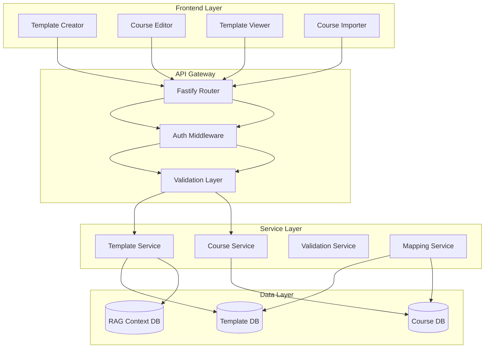
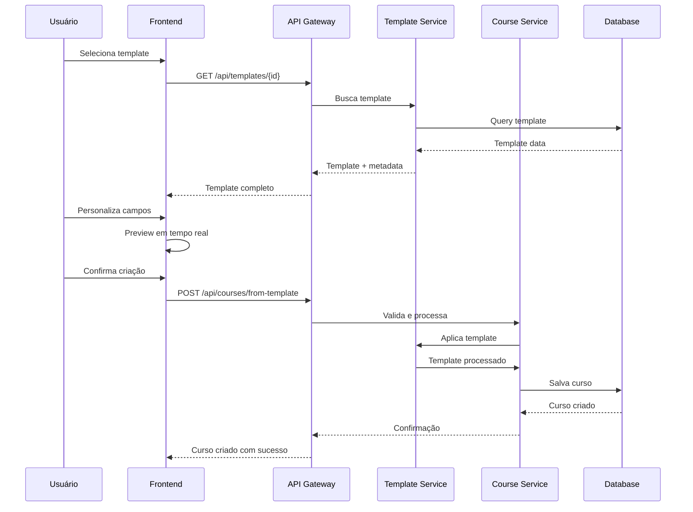
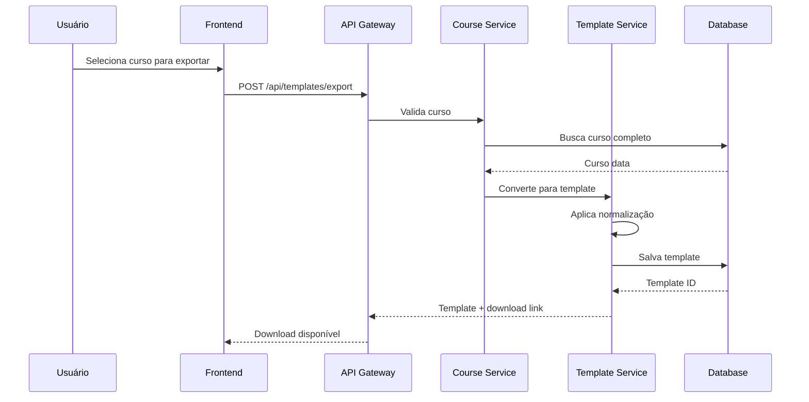

# Projeto Técnico: Integração de Módulos de Curso e Template

## 1. Visão Geral do Projeto

### 1.1 Objetivo
Desenvolver uma solução técnica robusta para integrar o módulo de cursos existente com o sistema de templates genéricos, permitindo criação, personalização e gestão eficiente de cursos baseados em templates padronizados.

### 1.2 Escopo
- Integração bidirecional entre módulo de cursos e sistema de templates
- Sistema de versionamento de templates
- Importação/exportação de templates
- Personalização dinâmica de conteúdo
- Gestão de metadados de templates

## 2. Arquitetura do Sistema

### 2.1 Arquitetura de Alto Nível



### 2.2 Componentes Principais

#### 2.2.1 Template Engine
- **Processador de Templates**: Renderização dinâmica de [[Field]] placeholders
- **Validador de Schema**: Garante conformidade com estrutura esperada
- **Versionador**: Controle de versões de templates

#### 2.2.2 Course Builder
- **Importador**: Carrega templates e converte para cursos
- **Personalizador**: Interface para edição de campos do template
- **Validador**: Verifica integridade do curso gerado

#### 2.2.3 Data Mapper
- **Schema Mapper**: Mapeia estrutura de template para curso
- **Field Resolver**: Resolve placeholders para valores reais
- **Relationship Manager**: Gerencia dependências entre elementos

## 3. Requisitos Funcionais

### 3.1 RF1 - Gestão de Templates
| ID | Descrição | Prioridade |
|---|---|---|
| RF1.1 | Criar novo template a partir de curso existente | Alta |
| RF1.2 | Importar template externo (JSON/Markdown) | Alta |
| RF1.3 | Exportar template para compartilhamento | Alta |
| RF1.4 | Versionar templates com histórico | Média |
| RF1.5 | Clonar templates existentes | Média |
| RF1.6 | Validar estrutura de templates | Alta |

### 3.2 RF2 - Criação de Cursos via Template
| ID | Descrição | Prioridade |
|---|---|---|
| RF2.1 | Selecionar template da biblioteca | Alta |
| RF2.2 | Personalizar campos do template | Alta |
| RF2.3 | Visualizar preview antes de criar | Alta |
| RF2.4 | Configurar parâmetros específicos | Média |
| RF2.5 | Gerar cronograma automático | Alta |
| RF2.6 | Validar curso gerado | Alta |

### 3.3 RF3 - Sincronização e Atualização
| ID | Descrição | Prioridade |
|---|---|---|
| RF3.1 | Atualizar cursos baseados em template alterado | Média |
| RF3.2 | Notificar sobre atualizações de template | Baixa |
| RF3.3 | Merge de mudanças em cursos existentes | Baixa |
| RF3.4 | Rollback de atualizações | Baixa |

### 3.4 RF4 - Busca e Filtros
| ID | Descrição | Prioridade |
|---|---|---|
| RF4.1 | Buscar templates por categoria | Alta |
| RF4.2 | Filtrar por nível de dificuldade | Alta |
| RF4.3 | Ordenar por popularidade/data | Média |
| RF4.4 | Busca full-text em templates | Média |

## 4. Requisitos Não-Funcionais

### 4.1 Performance
- **RNF1**: Carregamento de templates < 2 segundos
- **RNF2**: Processamento de importação < 5 segundos para templates até 1MB
- **RNF3**: Suporte para 1000+ templates simultâneos

### 4.2 Segurança
- **RNF4**: Validação de entrada contra XSS/SQL injection
- **RNF5**: Autenticação obrigatória para operações de escrita
- **RNF6**: Auditoria de mudanças em templates

### 4.3 Usabilidade
- **RNF7**: Interface intuitiva com drag-and-drop
- **RNF8**: Preview em tempo real
- **RNF9**: Undo/redo de operações

### 4.4 Manutenibilidade
- **RNF10**: Código 100% TypeScript com tipagem forte
- **RNF11**: Testes unitários com cobertura > 80%
- **RNF12**: Documentação automática via JSDoc

## 5. Fluxo de Dados

### 5.1 Fluxo de Criação de Curso via Template



### 5.2 Fluxo de Exportação de Template



## 6. APIs e Endpoints

### 6.1 Template Management API

#### 6.1.1 GET /api/templates
```typescript
// Request
GET /api/templates?category=martial_arts&level=beginner&limit=20&offset=0

// Response
{
  "templates": [{
    "id": "uuid",
    "name": "string",
    "description": "string",
    "category": "martial_arts|dance|fitness|language|music|other",
    "level": "beginner|intermediate|advanced|expert|master",
    "version": "1.0.0",
    "fields": [{
      "key": "string",
      "type": "text|number|date|select|textarea",
      "required": boolean,
      "default": "any"
    }],
    "metadata": {
      "author": "string",
      "createdAt": "ISO8601",
      "updatedAt": "ISO8601",
      "usageCount": 0
    }
  }],
  "total": 0,
  "hasMore": false
}
```

#### 6.1.2 POST /api/templates
```typescript
// Request
POST /api/templates
{
  "name": "string",
  "description": "string",
  "category": "string",
  "level": "string",
  "content": "string (markdown with placeholders)",
  "fields": [...],
  "metadata": {...}
}

// Response
{
  "id": "uuid",
  "status": "created",
  "downloadUrl": "string"
}
```

#### 6.1.3 GET /api/templates/{id}
```typescript
// Response
{
  "id": "uuid",
  "name": "string",
  "description": "string",
  "content": "string",
  "fields": [...],
  "version": "string",
  "changelog": [...]
}
```

### 6.2 Course from Template API

#### 6.2.1 POST /api/courses/from-template
```typescript
// Request
POST /api/courses/from-template
{
  "templateId": "uuid",
  "customizations": {
    "courseName": "string",
    "instructorName": "string",
    "durationWeeks": 12,
    "customFields": {...}
  },
  "options": {
    "generateSchedule": true,
    "createLessons": true,
    "assignTechniques": true
  }
}

// Response
{
  "courseId": "uuid",
  "status": "created",
  "previewUrl": "string",
  "editUrl": "string"
}
```

#### 6.2.2 GET /api/courses/{id}/template-info
```typescript
// Response
{
  "courseId": "uuid",
  "templateId": "uuid|null",
  "templateVersion": "string|null",
  "customizations": {...},
  "isOutdated": boolean,
  "updateAvailable": boolean
}
```

## 7. Casos de Uso Detalhados

### 7.1 UC1 - Criar Curso a partir de Template

**Ator Principal**: Instrutor
**Pré-condições**: Usuário autenticado e autorizado
**Pós-condições**: Curso criado e disponível para gerenciamento

**Fluxo Principal**:
1. Instrutor acessa "Criar Curso"
2. Sistema exibe biblioteca de templates
3. Instrutor filtra por categoria/nível
4. Instrutor seleciona template
5. Sistema exibe preview do template
6. Instrutor personaliza campos obrigatórios
7. Sistema valida personalizações
8. Instrutor confirma criação
9. Sistema gera curso
10. Sistema redireciona para editor de curso

**Fluxos Alternativos**:
- 3a. Nenhum template encontrado → Sistema sugere criar do zero
- 6a. Validação falha → Sistema exibe erros específicos
- 9a. Erro no processamento → Sistema rollback e notifica

### 7.2 UC2 - Exportar Curso como Template

**Ator Principal**: Administrador
**Pré-condições**: Curso existente e completo
**Pós-condições**: Template disponível na biblioteca

**Fluxo Principal**:
1. Administrador acessa curso
2. Seleciona "Exportar como Template"
3. Sistema valida estrutura do curso
4. Administrador define metadados do template
5. Sistema processa e normaliza conteúdo
6. Sistema salva template
7. Sistema disponibiliza para uso

### 7.3 UC3 - Atualizar Curso baseado em Template

**Ator Principal**: Instrutor
**Pré-condições**: Curso criado a partir de template
**Pós-condições**: Curso atualizado com mudanças do template

**Fluxo Principal**:
1. Sistema detecta atualização de template
2. Notifica instrutores com cursos afetados
3. Instrutor acessa curso
4. Visualiza diff das mudanças
5. Seleciona quais mudanças aplicar
6. Confirma atualização
7. Sistema aplica mudanças selecionadas

## 8. Cronograma de Implementação

### 8.1 Fase 1 - Fundação (2 semanas)
- **Semana 1**: Setup do projeto e estrutura base
  - Configuração de ambiente de desenvolvimento
  - Criação de schemas de banco de dados
  - Setup de testes automatizados
- **Semana 2**: APIs básicas de template
  - CRUD de templates
  - Validação de estrutura
  - Testes unitários

### 8.2 Fase 2 - Integração (3 semanas)
- **Semana 3**: Backend de integração
  - Service de mapeamento
  - Processador de templates
  - APIs de criação de curso
- **Semana 4**: Frontend - Template Library
  - Interface de busca e filtro
  - Preview de templates
  - Seleção e personalização
- **Semana 5**: Frontend - Course Builder
  - Importação de templates
  - Personalização dinâmica
  - Validação em tempo real

### 8.3 Fase 3 - Avançado (2 semanas)
- **Semana 6**: Features avançadas
  - Versionamento de templates
  - Sincronização de mudanças
  - Exportação de templates
- **Semana 7**: Otimização e testes
  - Performance tuning
  - Testes de integração
  - Documentação final

### 8.4 Fase 4 - Deploy (1 semana)
- **Semana 8**: Deploy e monitoramento
  - Deploy em produção
  - Monitoramento de performance
  - Ajustes baseados em feedback

## 9. Critérios de Aceitação

### 9.1 Funcionais
- [ ] Template genérico pode ser importado e usado para criar cursos
- [ ] Todos os campos do template são editáveis durante a criação
- [ ] Preview em tempo real funciona corretamente
- [ ] Cursos criados mantêm referência ao template original
- [ ] Exportação de curso como template gera arquivo válido
- [ ] Busca e filtros retornam resultados relevantes

### 9.2 Técnicos
- [ ] APIs respondem em < 2 segundos para operações comuns
- [ ] Cobertura de testes > 80%
- [ ] Nenhum erro crítico em logs
- [ ] Validação de entrada previne injeção de código
- [ ] Autenticação e autorização funcionando corretamente

### 9.3 UX
- [ ] Interface intuitiva com feedback visual
- [ ] Erros são exibidos de forma clara
- [ ] Processo de criação leva < 5 minutos
- [ ] Preview é preciso e útil

## 10. Riscos e Mitigação

### 10.1 Riscos Técnicos

| Risco | Probabilidade | Impacto | Mitigação |
|---|---|---|---|
| Incompatibilidade de schemas | Média | Alto | Validadores robustos e testes de integração |
| Performance com templates grandes | Baixa | Médio | Paginação e lazy loading |
| Perda de dados durante importação | Baixa | Alto | Transações atômicas e backups |
| Conflitos de versão | Média | Médio | Sistema de merge inteligente |

### 10.2 Riscos de Negócio

| Risco | Probabilidade | Impacto | Mitigação |
|---|---|---|---|
| Resistência à mudança | Média | Médio | Treinamento e documentação |
| Templates mal estruturados | Média | Médio | Validadores automáticos |
| Dependência de templates externos | Baixa | Baixo | Templates internos como fallback |

### 10.3 Riscos de Segurança

| Risco | Probabilidade | Impacto | Mitigação |
|---|---|---|---|
| XSS via templates | Baixa | Alto | Sanitização de HTML |
| Acesso não autorizado | Baixa | Alto | Autenticação obrigatória |
| Vazamento de templates proprietários | Baixa | Médio | Controle de acesso granular |

## 11. Métricas de Sucesso

### 11.1 KPIs Técnicos
- Tempo médio de criação de curso: < 3 minutos
- Taxa de erro na importação: < 1%
- Tempo de resposta das APIs: < 2 segundos
- Disponibilidade do sistema: > 99.5%

### 11.2 KPIs de Negócio
- Redução de 70% no tempo de criação de cursos
- Aumento de 50% na reutilização de conteúdo
- Satisfação do usuário: > 85%
- Taxa de adoção de templates: > 60%

## 12. Manutenção e Evolução

### 12.1 Monitoramento
- Logs estruturados para todas as operações
- Métricas de performance via APM
- Alertas para erros críticos
- Dashboard de uso de templates

### 12.2 Manutenção
- Atualizações mensais de segurança
- Revisão trimestral de performance
- Expansão semestral de biblioteca de templates
- Feedback contínuo dos usuários

### 12.3 Roadmap Futuro
- **Q2 2025**: Templates colaborativos
- **Q3 2025**: IA para sugestão de templates
- **Q4 2025**: Marketplace de templates
- **Q1 2026**: Templates dinâmicos com lógica condicional

## 13. Anexos

### 13.1 Estrutura de Template JSON
```json
{
  "schemaVersion": "1.0",
  "template": {
    "id": "uuid",
    "name": "string",
    "description": "string",
    "category": "string",
    "level": "string",
    "content": {
      "markdown": "string with [[placeholders]]",
      "fields": [...],
      "sections": [...]
    },
    "metadata": {...}
  }
}
```

### 13.2 Checklist de Deploy
- [ ] Ambiente de staging configurado
- [ ] Testes de carga executados
- [ ] Documentação de usuário finalizada
- [ ] Treinamento de equipe concluído
- [ ] Rollback plan definido
- [ ] Monitoramento ativado

---

**Documento Aprovado Por**: [Equipe de Arquitetura]  
**Data**: 10/08/2025  
**Versão**: 1.0  
**Próxima Revisão**: 10/09/2025